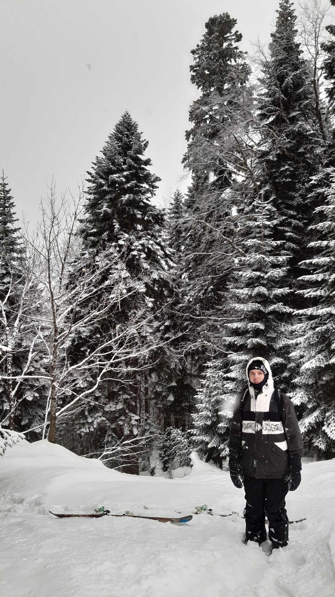

Hi, I'm Simon, full-stack software engineer and writer.

I've built my first web-page at 16 in Macromedia Dreamweaver. It was "A quantum physics in simple terms" educational site. I remember I used some random googled JavaScript scenarios for dynamic menus and my site was starting through VisualBasic app with drum'n'bass 😂. I had pretty much zero understanding of what's going on inside😊. Now when I got a Master's Degree in CS and went through some projects I have a little bit more knowledge about the insides of this thing called web application.

📚 I'm a big fan of [learning](https://www.simonbliznyuk.com/things-i-dont-know) new technologies and discovering how things work.

My belief is that documenting and sharing new knowledge helps to understand deeper the things you've researched.

🙌 This blog is inspired by [Kalle Hallden's](https://www.youtube.com/channel/UCWr0mx597DnSGLFk1WfvSkQ/channels), [Tania Rascia's](https://www.taniarascia.com/)  and [Flavio Copes's](https://flaviocopes.com/) works.

My current setup is pretty simple:

- Lenovo T520 laptop
- Samsung SA650 monitor
- Ikea desk
- Some random mouse and keyboard

🎷 Music is also my big passion and a huge part of my life. It helps me to go through the long coding sessions. [Here is the place](https://soundcloud.com/steamysunnyspace) where I try to give some structure to my latest findings.
