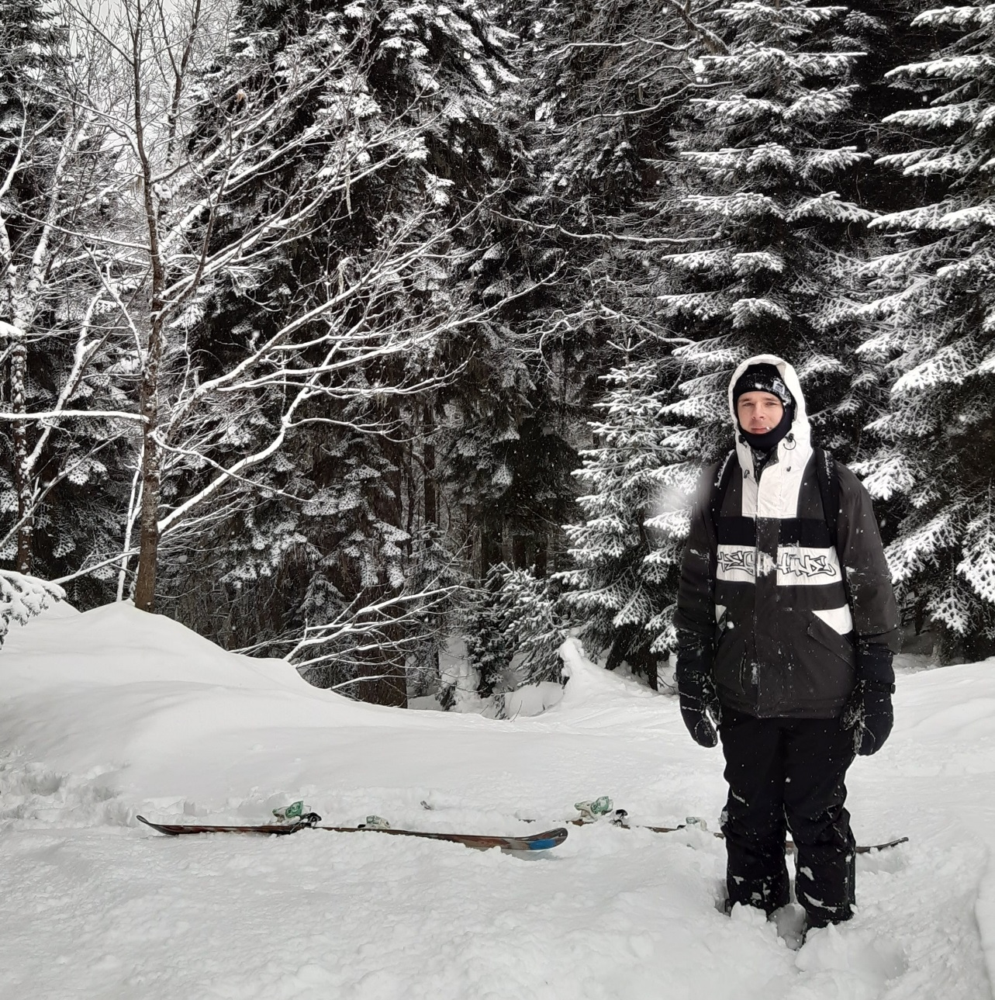

👋 Hi, I'm Simon, full-stack software engineer and technical writer.

I've built my first web-page at 16 in Macromedia Dreamweaver. It was "A quantum physics in simple terms" site. I remember I used some random googled JavaScript scenarios for dynamic menus and my site was starting through VisualBasic desktop app with drum'n'bass 😂. I had pretty much zero understanding of what's going on inside😊.

Since then I had received a Master's Degree in CS and managed to work in various positions: from a carwash worker to a chef's assistant in the restaurant, from a laboratory worker to an engineer in the software development company.

📚 I've always been a big fan of [learning](https://www.simonbliznyuk.com/things-i-dont-know) new technologies and discovering how things work.

Now besides my full-time job as a DevOps & QA engineer, I learn full-stack web development and write [open-source](https://github.com/semaphore8) code in my spare time.

I believe that documenting and sharing new knowledge helps to understand deeper the things you've researched. So I try to share my new findings that aren't well highlighted on the web. I'll be very happy knowing if someone would solve his problem by reading one of my posts.

🙌 This blog is inspired by [Kalle Hallden's](https://www.youtube.com/channel/UCWr0mx597DnSGLFk1WfvSkQ/channels), [Tania Rascia's](https://www.taniarascia.com/)  and [Flavio Copes's](https://flaviocopes.com/) works.

## My setup

My current setup is pretty simple:

- Lenovo T520 laptop
- Samsung SA650 monitor
- Ikea desk
- Some random mouse and keyboard
- VSCode

## Soundcloud

> We are what we listen to, who we listen to and who we listen with. Nico Jaar

🎷 Music is also my big passion and a huge part of my life. It helps me to go through the long coding sessions. [Here is the place](https://soundcloud.com/steamysunnyspace) where I try to give some structure to my latest findings.
