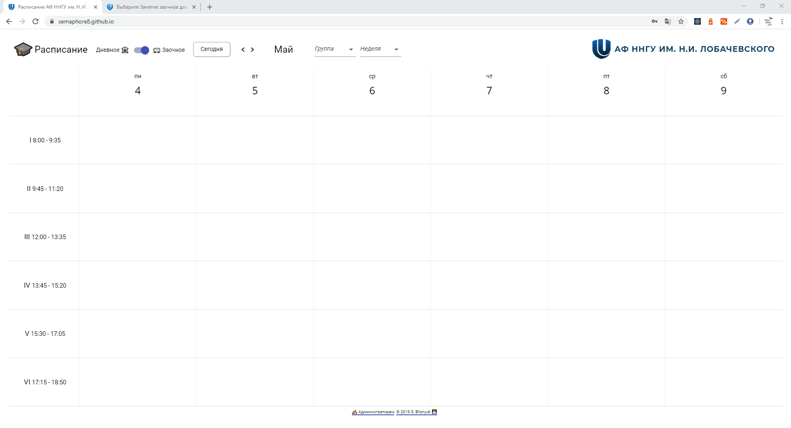
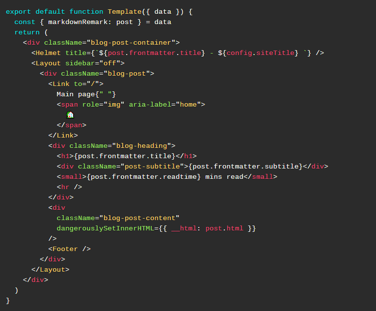

## 📅 Class schedule

Class schedule MVC single-page web-application with admin interface

Built on: *Django, Django REST Framework, React, JavaScript, MaterialUI*

[Demo](https://semaphore8.github.io/) [Source](https://github.com/semaphore8/schedule_nngu)

## 💻 My dev blog

Blog-theme for Gatsby based on my personal page, Jamstack app

Built on: *Gatsby, React, GraphQL, Sass*

[Demo](https://www.simonbliznyuk.com) [Source](https://github.com/semaphore8/devblog)

## 🎨 Mokaidia

PrismJS theme based on "okaidia"

Built on: *CSS*

[Demo & Source](https://github.com/semaphore8/mokaidia)