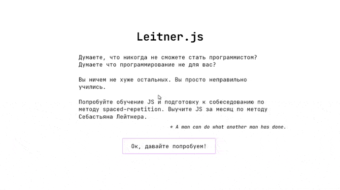

## 📅 Class schedule

Class schedule MVC single-page web-application with admin interface

Built on: *Django, Django REST Framework, React, JavaScript, MaterialUI*

[Demo](https://sematgt.github.io/) * *give it some time to wake up backend servers on the first visit. frontend admin creds* **guest**:**asdf^jkl;**

[Source](https://github.com/sematgt/schedule_nngu)

## 💻 My dev blog

Blog-theme for Gatsby based on my personal page, Jamstack app

Built on: *Gatsby, React, GraphQL, Sass*

[Demo](https://www.simonbliznyuk.com) [Source](https://github.com/sematgt/devblog)

## 🗃️ Leitner.js

JavaScript flashcards study system based on spaced-repetition method and Leitner learning system.

WIP

## 🎨 Mokaidia

PrismJS theme based on "okaidia"

Built on: *CSS*

[Demo & Source](https://github.com/sematgt/mokaidia)