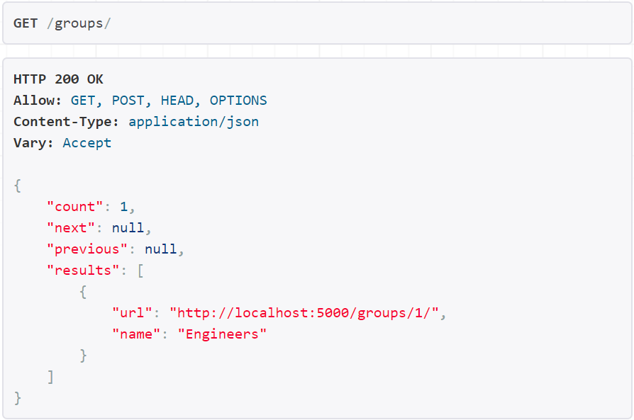
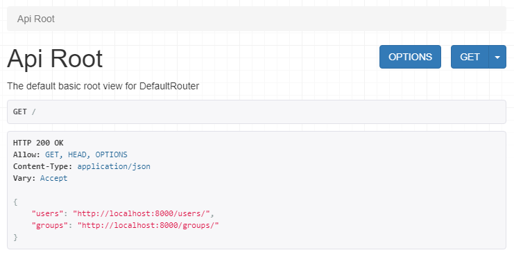

Internet security is a process and you always need to get an eye on the latest security vulnerabilities of a tech stack that you've chosen to build your web app. But if you are using Django it won't be such a big problem as Django provides pretty nice out-of-the-box security solutions so you don't have to implement big amount of things by yourself.

Authentication and authorization is the first thing you need to know in order to make your REST API secure and well protected. After this tutorial you will realize that it's not that hard.

Let's dive into it! 🙂

## Goals

1. Learn how permissions and authentication is used in Django REST Framework.
2. Learn how to quick and simply implement access control to API. 

## Prerequisites

What u should know to start this tutorial? More links there!

## Let`s start

In Django REST Framework(DRF) permissions together with authentication and [throttling]([https://www.django-rest-framework.org/api-guide/throttling/](https://www.django-rest-framework.org/api-guide/throttling/)) determine whether a request to API should be granted or denied access.

Permissions are used for different classes of users and for different parts of the API. DRF always check permissions before running any code in views.

Permissions in DRF represents a list of classes which must be checked before any code executes. There are 7 built-in [permission classes]([https://www.django-rest-framework.org/api-guide/permissions/#api-reference](https://www.django-rest-framework.org/api-guide/permissions/#api-reference)) in DRF:

- `AllowAny`
- `IsAuthenticated`
- `IsAdminUser`
- `IsAuthenticatedOrReadOnly`
- `DjangoModelPermissions`
- `DjangoModelPermissionsOrAnonReadOnly`
- `DjangoObjectPermissions`

And you can [build it custom]([https://www.django-rest-framework.org/api-guide/permissions/#custom-permissions](https://www.django-rest-framework.org/api-guide/permissions/#custom-permissions)) by yourself.

Permissions may be set globally to all API, on an object level or right into the views.

## Setting permissions globally

Setting permissions globally is the easiest way to implement user access to your API. You can do it by adding a string to your Django project's `settings.py` file:

```python
REST_FRAMEWORK = {
    'DEFAULT_PERMISSION_CLASSES': [
        'rest_framework.permissions.IsAuthenticated',
    ]
}
```

Default global permissions class is `text>'rest_framework.permissions.AllowAny'`.

## Setting permissions in views

The second way to set permissions in out Django project's is to specify it in views.

First of all we need to pull Django REST Framework API starter from Github repo and run it's virtual environment:

> Note: if you have a problems running this commands on Windows, try to use [Windows style paths]([https://en.wikipedia.org/wiki/Path_(computing)#MS-DOS/Microsoft_Windows_style](https://en.wikipedia.org/wiki/Path_(computing)#MS-DOS/Microsoft_Windows_style)) with backslashes.

```bash
git clone https://github.com/semaphore8/Django-REST-Framework-API-starter.git ./starter
cd ./starter
source ./env/Scripts/activate # for Windows just enter .\env\Scripts\activate.bat
```

 Then let's open this project in IDE. In my case it is VS Code:

```bash
code .
```

And run Django's development server:

```bash
python manage.py runserver
```

As we can see there is no restriction in access to API now:



Let's try to add a group. Head over the 'groups' endpoint and add a group called 'Engineers' through the HTML form. As you can see we can `POST` requests to API without authorization:



To set permissions to our views we 

```jsx
export default function Template ({
 data,
}) {
 const { markdownRemark: page } = data
 return (
  <div className="blog-page-container">
   <Helmet title={`${config.siteTitle} - ${page.frontmatter.title}`} />
   <Layout sidebar="off">
    <div className="blog-page">
     <Link to="/">Main page <span role="img" aria-label="home">🏡</span></Link>
     <h1>{page.frontmatter.title}</h1>
     <div
      className="blog-page-content"
      dangerouslySetInnerHTML={{ __html: page.html }} />
    </div>
   </Layout>
  </div>
 )
}
```

## Setting permission in objects

setting permissions in objects

## Setting the authentication scheme

Auth may be 4 built in types:

1

2

3

4

Auth scheme as a permissions can be set globally:


​    

On views or viewsets:

​    

## Summary

We`ve learned how to:

Now you know how to implement authorization to your API.

This is the first checkpoint of the security process of your web-app. Here is some more security recommendations from Django team. [https://docs.djangoproject.com/en/3.0/topics/security/](https://docs.djangoproject.com/en/3.0/topics/security/)