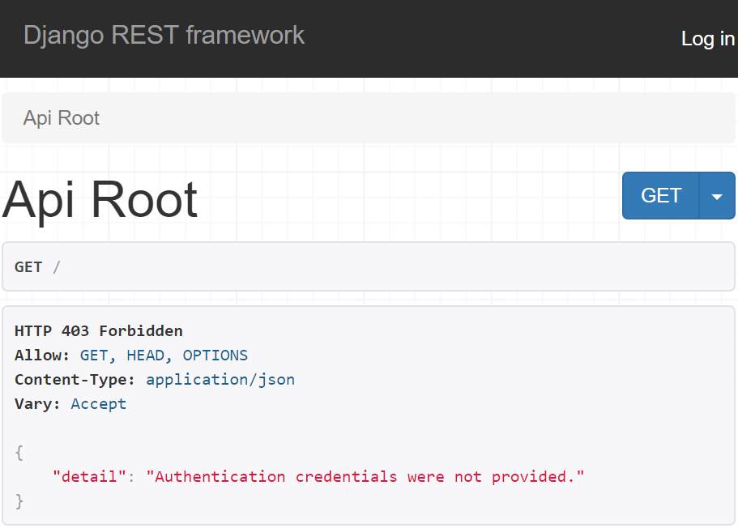
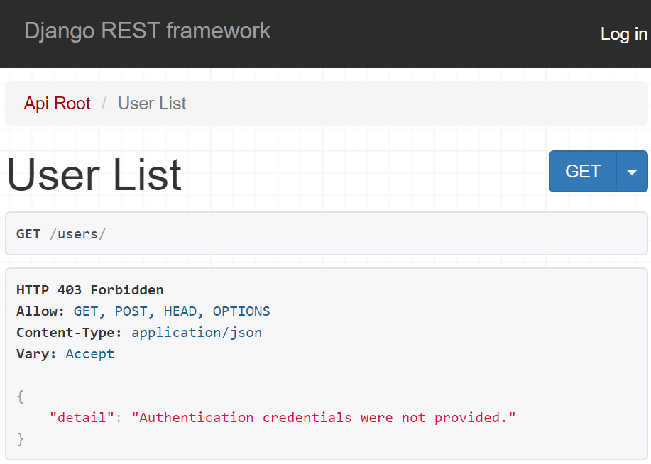
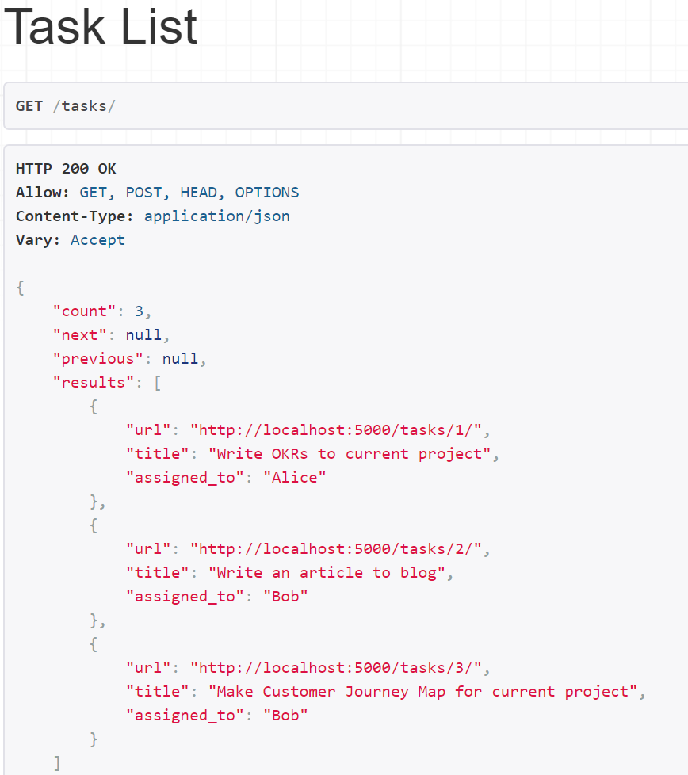
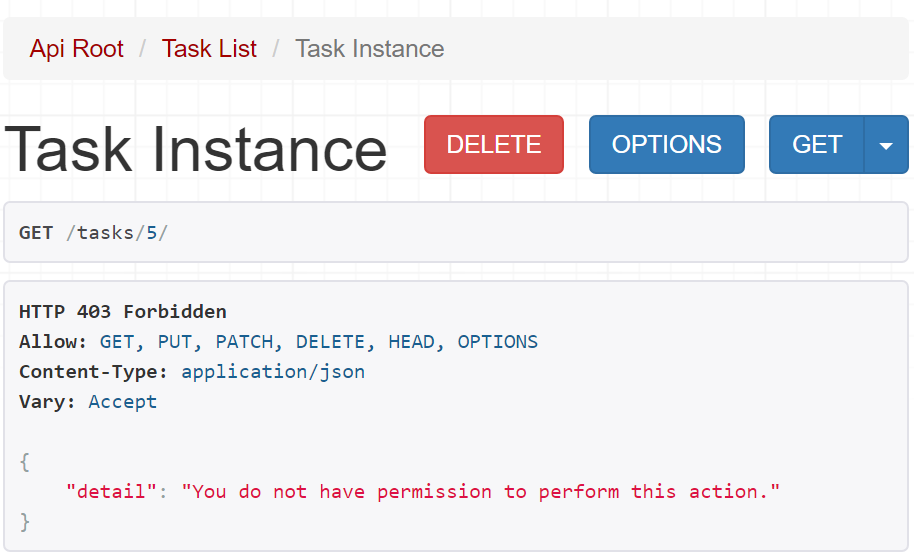

 on [Unsplash](https://unsplash.com/s/photos/closed-road?utm_source=unsplash&utm_medium=referral&utm_content=creditCopyText)")

Permissions are the first thing you need to know in order to make your REST API secure and well protected. After this tutorial, you will realize that it's not that hard.

## Goals

1. Learn how permissions are used in Django REST Framework.
2. Learn how to quick and simply implement it to your API.

## Prerequisites

- Basic Django and Django REST Framework knowledge ('Hello World' is enough)
- Basic Git knowledge (optional)

## Let`s start 💨

In Django REST Framework(DRF) permissions together with authentication and [throttling](https://www.django-rest-framework.org/api-guide/throttling/) determine whether a request to API should be granted or denied access.

## Permissions

Permissions are used for different classes of users and for different parts of the API. DRF always check permissions before running any code in views.

Permissions in DRF represent a list of classes that must be checked before any code executes. There are 7 pre-built permission classes in DRF:

- `AllowAny`
- `IsAuthenticated`
- `IsAdminUser`
- `IsAuthenticatedOrReadOnly`
- `DjangoModelPermissions`
- `DjangoModelPermissionsOrAnonReadOnly`
- `DjangoObjectPermissions`

You can either [build custom classes](https://www.django-rest-framework.org/api-guide/permissions/#custom-permissions) by yourself.

Permissions in Django REST Framework may be set in 3 different ways:

1. Globally to all API endpoints  
2. Into the views or viewsets
3. On an object level 

Now let's take a look at each of these methods. In this article, I'll use this [Django REST Framework starter](https://github.com/semaphore8/Django-REST-Framework-API-starter.git). You can clone it to your local machine and pass-through this tutorial with me.

### Setting permissions globally

Setting permissions globally is the easiest way to implement user access to your API. You can do it by adding a string to your Django project's `settings.py` file:

```python
REST_FRAMEWORK = {
    'DEFAULT_PERMISSION_CLASSES': [
        'rest_framework.permissions.IsAuthenticated',
    ]
}
```

Now we can't access our API endpoints without authentication:



Now let's set global permissions class back to `rest_framework.permissions.AllowAny`  which is the default permission class in DRF. It gives users unrestricted access to API without authentication.

```python
REST_FRAMEWORK = {
    'DEFAULT_PERMISSION_CLASSES': [
        'rest_framework.permissions.AllowAny',
    ]
}
```

### Setting permissions in views

The second way to set permissions in our Django project is to specify it in the views(or in the viewsets).

We have 3 viewsets in `views.py`:

```python
from django.shortcuts import render
from django.contrib.auth.models import User, Group
from rest_framework import viewsets
from starter.app.serializers import UserSerializer, GroupSerializer
from .models import Task
from .serializers import TaskSerializer

class UserViewSet(viewsets.ModelViewSet):
 
    queryset = User.objects.all().order_by('-date_joined')
    serializer_class = UserSerializer

class GroupViewSet(viewsets.ModelViewSet):
 
    queryset = Group.objects.all()
    serializer_class = GroupSerializer

class TaskViewSet(viewsets.ModelViewSet):

    queryset = Task.objects.all()
    serializer_class = TaskSerializer
```

Let's add a permissions to the 'Groups' viewset. You can do it by simply adding `permission_classes` definition to viewset class. We'll use one of the DRF's built-in permissions. Don't forget to import it from `rest_framework.permissions` module:

```python{7,13}
from django.shortcuts import render
from django.contrib.auth.models import User, Group
from rest_framework import viewsets
from starter.app.serializers import UserSerializer, GroupSerializer
from .models import Task
from .serializers import TaskSerializer
from rest_framework.permissions import IsAuthenticated

class UserViewSet(viewsets.ModelViewSet):
 
    queryset = User.objects.all().order_by('-date_joined')
    serializer_class = UserSerializer
    permission_classes = [IsAuthenticated]

class GroupViewSet(viewsets.ModelViewSet):
 
    queryset = Group.objects.all()
    serializer_class = GroupSerializer

class TaskViewSet(viewsets.ModelViewSet):

    queryset = Task.objects.all()
    serializer_class = TaskSerializer
```

As you can see now we can't get access to users list endpoint:



### Setting permission in objects

DRF is also supporting object-level permissioning. Object-level permissions are usually used when some type of user is allowed or restricted to interact with a particular object. An object in this case typically refers to a model instance.

As you can see in our database we have some tasks assigned to either Bob or Alice.



Consider all users can view a list of current tasks, but only the person who was delegated to work on the specific task has access to its details.

To implement such behavior on our API we should build a custom permission class. Let's make a local module `permissions.py` in our Django app's folder (near `views.py`) and add our new class here.

In order to implement custom permission in the object level, we must inherit from `BasePermission` DRF's class and override `.has_permission(self, request, view)` method:

```python
from rest_framework import permissions

class IsAssigned(permissions.BasePermission): 
    """
    Only person who assigned has permission
    """

    def has_object_permission(self, request, view, obj):
		# check if user who launched request is object owner 
        if obj.assigned_to == request.user: 
            return True
        else:
            return False
```

Now we need to add permissions to our `TaskViewSet` in `views.py`. Don't forget to import it.

```python{1,7}
from .permissions import IsAssigned

#...

class TaskViewSet(viewsets.ModelViewSet):

    queryset = Task.objects.all()
    serializer_class = TaskSerializer
    permission_classes = [IsAssigned]
```

At this point if you login to API as "Alice" (password is the same as login), you could see tasks list but couldn't get to Bob's tasks:

 

## Summary

Internet security is a process and you always need to get an eye on the latest security vulnerabilities of a tech stack that you've chosen to build your web app. 

If you are using Django it won't be such a big problem as Django provides pretty nice out-of-the-box security solutions so you don't have to implement a big amount of things by yourself.

We`ve learned:

- What are permissions in Django REST Framework 
- What built-in permissions classes DRF has
- How to write custom permission classes
- How to set permissions globally, per-view and on object level

You can get the resulted source code of this tutorial on my [github page](https://github.com/semaphore8/Tutorials/tree/master/Django-REST-API-authentication-and-permissions/complete). 

*P.S.* There are also several [third party packages](https://www.django-rest-framework.org/api-guide/permissions/#third-party-packages) providing permissions control for Django REST Framework in case you want to build more complex access rules to your project.
